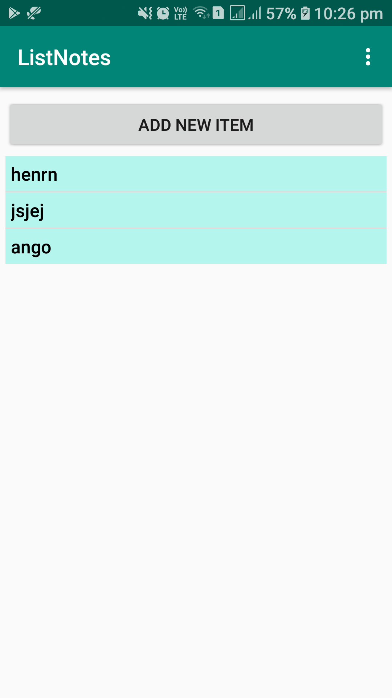
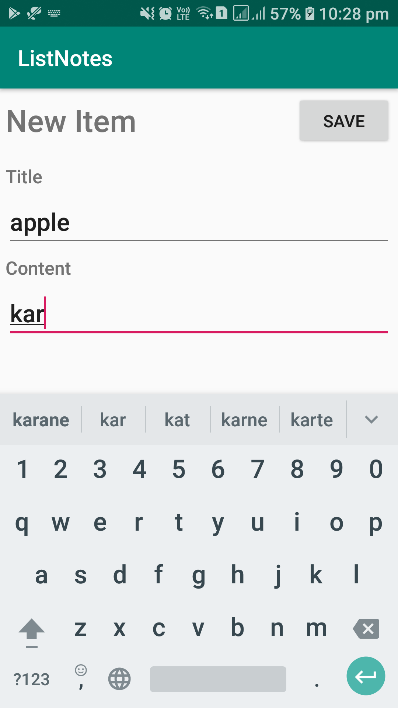
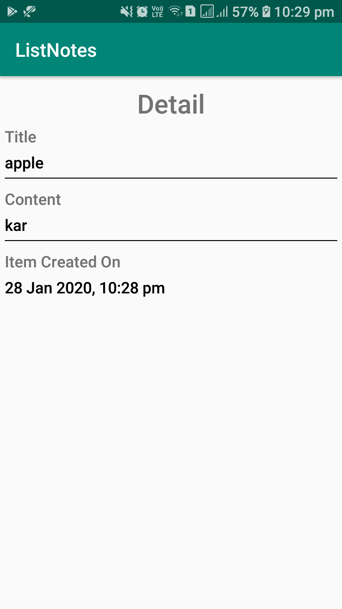
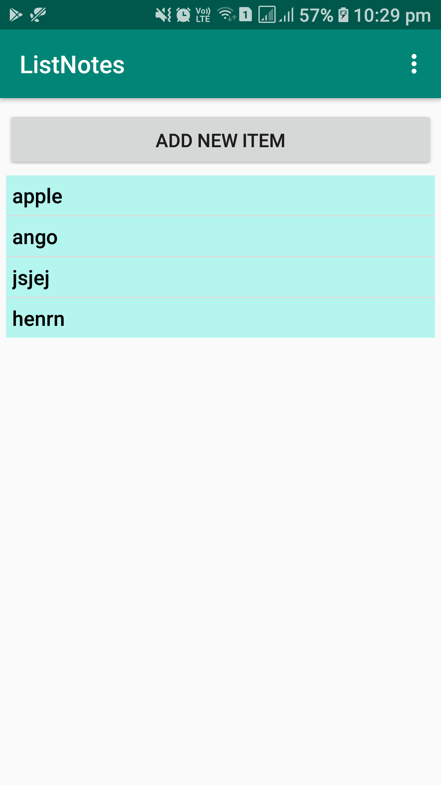

# ListNotes

App Details ->
1. Minimum Sdk version -> 26
2. Target Sdk version -> 29
3. Tested on -> samsung s10

How to Build ->
1. import project into android studio
2. sync gradle files to get all dependencies
3. click on run icon --> app will build and run

How to Run Tests ->
1. select ActivityTestSuite, right click and click on run, this will execute tests on emulator.

App OverView ->
1. Dashboard Screen -> having a button to create new item and list of items
2. Add New Item Screen -> having edit text to put title and content and save button to save content
3. Detail Item Screen -> Showing details of item

